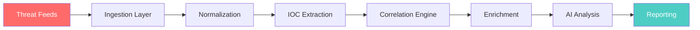

<div align="center">

# 🛡️ Threat Intelligence Platform

[](https://nodejs.org/)
[](https://nodejs.org/api/esm.html)
[](https://nodejs.org/api/test.html)
[](https://www.docker.com/)
[](LICENSE)
[](README.md)

**🚀 Modern, security-focused threat intelligence aggregation and analysis platform**

</div>

---

## ✨ Features

| Feature | Description |
|---------|-------------|
| 🔌 **Multi-Source Ingestion** | REST APIs, RSS feeds, STIX/TAXII support |
| 🔍 **IOC Extraction** | IPs, domains, hashes, URLs with validation |
| 🔗 **Correlation Engine** | Deduplication + multi-source aggregation |
| 🧠 **AI-Powered Analysis** | LLM enrichment with Zod validation |
| 📊 **Multiple Outputs** | Console, JSON, NDJSON, STIX 2.1 |
| 🐳 **Containerized** | Docker + Docker Compose ready |
| 🔐 **Security First** | Secret redaction, input validation, non-root execution |
| ⚡ **High Performance** | Controlled concurrency with p-limit |
| 🧪 **Tested** | 42 passing unit tests |

---

## 🎯 Quick Start

### Prerequisites

- Node.js ≥ 20
- Docker & Docker Compose (optional)

### Installation

```bash
# Clone the repository
git clone https://github.com/aiagentmackenzie-lang/threat-intelligence-platform.git
cd threat-intelligence-platform

# Install dependencies
npm install

# Copy environment template
cp .env.example .env
```

### 🚀 Run It

```bash
# CLI mode
npm start

# Development mode (with watch)
npm run dev

# Run the test suite
npm test
```

### 🐳 Docker Deployment

```bash
# Build and run
docker compose build
docker compose run --rm threat-intel-cli

# With environment variables
docker compose run --rm -e OPENAI_API_KEY=xxx threat-intel-cli
```

---

## 🏗️ Architecture



### Pipeline Stages

```
┌─────────────────────────────────────────────────────────────┐
│                    DATA FLOW                                 │
├─────────────────────────────────────────────────────────────┤
│  1. INGEST    → Fetch from APIs, RSS, feeds                │
│  2. NORMALIZE → Convert to common schema (Zod validated)   │
│  3. EXTRACT   → Parse IOCs (IPs, domains, hashes, URLs)    │
│  4. CORRELATE → Deduplicate & aggregate sources            │
│  5. ENRICH    → Query AbuseIPDB, VirusTotal, GeoIP         │
│  6. ANALYZE   → LLM risk assessment (OpenAI)               │
│  7. REPORT    → Output to console/JSON/NDJSON/STIX         │
└─────────────────────────────────────────────────────────────┘
```

---

## 💻 Usage Examples

### Basic Run

```bash
# Show all options
npm start -- --help

# Run with specific feeds
npm start -- --feeds abuseipdb

# Output as JSON
npm start -- --format json --output report.json

# Skip enrichment (faster)
npm start -- --skip-enrichment

# Skip AI analysis
npm start -- --skip-ai
```

### Programmatic Usage

```javascript
import { executePipeline } from './src/pipeline.js';
import { loadConfig } from './src/config/loader.js';

// Load feeds
const feeds = await loadConfig();
const enabledFeeds = feeds.filter(f => f.enabled);

// Run pipeline
const results = await executePipeline(enabledFeeds, {
  skipEnrichment: false,
  skipAI: false
});

console.log(`Processed ${results.analyzed.length} threats`);
```

### Custom Feed Configuration

```json
// config/feeds.json
[
  {
    "name": "abuseipdb",
    "type": "rest",
    "url": "https://api.abuseipdb.com/api/v2/blacklist",
    "auth": {
      "type": "header",
      "headerName": "Key",
      "env": "ABUSEIPDB_API_KEY"
    },
    "enabled": true
  },
  {
    "name": "rss-feed",
    "type": "rss",
    "url": "https://example.com/threats.xml",
    "enabled": true
  }
]
```

---

## 🔧 Configuration

### Environment Variables

| Variable | Description | Required For |
|----------|-------------|--------------|
| `ABUSEIPDB_API_KEY` | AbuseIPDB API access | AbuseIPDB feed |
| `VT_API_KEY` | VirusTotal lookups | VirusTotal enrichment |
| `MISP_API_KEY` | MISP integration | MISP feed |
| `OPENAI_API_KEY` | AI analysis | LLM features |
| `LOG_LEVEL` | Logging verbosity | Always (default: info) |

### IOC Extraction

| Type | Pattern | Example |
|------|---------|---------|
| **IP** | IPv4 public | `185.220.101.1` |
| **Domain** | Valid domain | `evil.com` |
| **Hash** | MD5/SHA1/SHA256 | `d41d8cd98f...` |
| **URL** | HTTP/HTTPS | `http://phishing.com` |

---

## 🧪 Testing

```bash
# Run all tests
npm test

# Output:
# ✔ 42 passing (250ms)
# ✔ IOC Extractor
# ✔ IOC Correlator  
# ✔ AI Analyzer
# ✔ Normalizer
# ✔ Enrichment
# ✔ Feed Ingestion
```

### Test Coverage

| Module | Coverage |
|--------|----------|
| `extractor.js` | 100% |
| `correlator.js` | 90%+ |
| `normalizer.js` | 90%+ |
| `analyzer.js` | 80%+ |

---

## 🔐 Security Features

```javascript
// Logger automatically redacts secrets
logger.info({ apiKey: 'sk-xxx' }); // → { apiKey: '[REDACTED]' }

// Input validation with Zod
const validated = Schema.safeParse(rawData);

// Private IP exclusion
isPrivateOrLoopbackIPv4('10.0.0.1'); // → true (excluded)
isPrivateOrLoopbackIPv4('8.8.8.8');  // → false (included)

// AI output validation
const analysis = AIAnalysisSchema.parse(llmResponse);
```

- ✅ **Secret Redaction** - API keys never logged
- ✅ **Input Validation** - Zod schema enforcement
- ✅ **Private IP Filtering** - Excludes RFC 1918 ranges
- ✅ **Non-Root Container** - Runs as `node` user
- ✅ **Content Limits** - 10MB max response size
- ✅ **Timeout Protection** - 15s default timeouts

---

## 📁 Project Structure

```
threat-intel-platform/
├── 📂 src/
│   ├── 📂 ai/
│   │   └── analyzer.js          # LLM analysis with Zod
│   ├── 📂 cli/
│   │   └── index.js               # CLI entry point
│   ├── 📂 config/
│   │   └── loader.js              # Zod-validated config
│   ├── 📂 enrichment/
│   │   └── enrich.js              # AbuseIPDB, VT, GeoIP
│   ├── 📂 ingestion/
│   │   └── feeds.js               # REST, RSS fetchers
│   ├── 📂 processing/
│   │   ├── correlator.js          # Deduplication
│   │   ├── extractor.js             # IOC parsing
│   │   └── normalizer.js            # Data normalization
│   ├── 📂 utils/
│   │   ├── logger.js                # Pino with redaction
│   │   └── reporter.js              # Output formatting
│   └── pipeline.js                  # Orchestration
├── 📂 config/
│   └── feeds.json                   # Feed definitions
├── 📂 tests/
│   └── *.test.js                  # 42 tests
├── Dockerfile                       # Multi-stage build
├── docker-compose.yml               # Container orchestration
└── README.md                        # This file
```

---

## 🎯 Roadmap

- [x] Core pipeline implementation
- [x] Docker containerization
- [x] Test suite (42 tests)
- [ ] STIX/TAXII server support
- [ ] Web dashboard UI
- [ ] Persistent database storage
- [ ] Background scheduler / daemon mode
- [ ] SIEM export connectors
- [ ] Metrics and tracing

---

## 🤝 Contributing

1. Fork the repository
2. Create your feature branch (`git checkout -b feature/amazing`)
3. Commit your changes (`git commit -m 'Add amazing feature'`)
4. Push to the branch (`git push origin feature/amazing`)
5. Open a Pull Request

---

## 📄 License

MIT © [See LICENSE](LICENSE)

---

<div align="center">

**Built with 🔥 by security engineers, for security engineers**

[](https://github.com/aiagentmackenzie-lang/threat-intelligence-platform)
[](https://github.com/aiagentmackenzie-lang/threat-intelligence-platform/fork)

</div>
